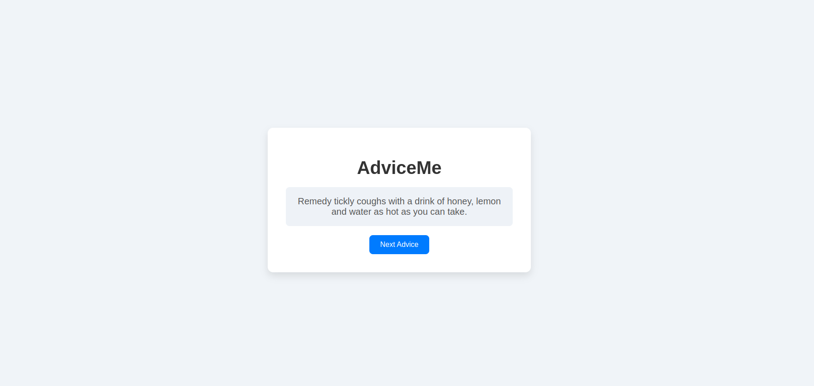

# AdviceMe

**AdviceMe** is a simple web application that fetches random pieces of advice from the [Advice Slip API](https://api.adviceslip.com) and displays them to the user. The user can click the "Next Advice" button to generate a new random piece of advice.

## Table of Contents

- [Demo](#demo)
- [Features](#features)
- [Technologies Used](#technologies-used)
- [Setup](#setup)
- [Usage](#usage)

## Demo

You can view a live demo of the project [here](https://advice-me-lilac.vercel.app/).

## Features

- Display random advice using the Advice Slip API.
- Fetch new advice with a single button click.
- Responsive design for different screen sizes.

## Technologies Used

- **HTML5**: The structure of the app.
- **CSS3**: Styling and animations for a clean, modern UI.
- **JavaScript**: Handles API requests and DOM manipulation.
- **Advice Slip API**: Provides random pieces of advice.

## Setup

To run this project locally, follow these steps:

1. **Clone the repository**:

   ```bash
   git clone https://github.com/Caleb-ne1/Advice-me.git
   ```

2. **Navigate to the project directory**:

```bash
cd Advice-me
```
Open the index.html file in your preferred web browser:


## Usage
Click the "Next Advice" button to fetch a random piece of advice.
Each new click will generate a different piece of advice.
Example of fetched advice:
```bash
"Don't sweat the small stuff."
```

## File Structure
```bash
AdviceMe/
│
├── index.html          # Main HTML file
├── style.css           # Styles for the app
├── script.js           # JavaScript to fetch and display advice
└── README.md           # Project documentation
```
